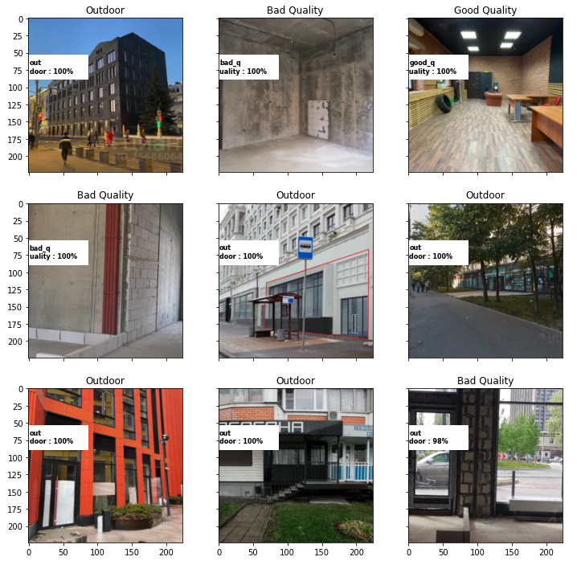

# Project, the purpose of which is to classify photography into classes: good finish quality, poor finish quality, street view or floor plan.

_The idea came when I was parsing ads for renting apartments. It happens that the set filter "good repair" is not always observed and therefore "bad" ads come across. The decision was made to make a neural network that will score ads, discarding obviously bad ads, thereby saving me time. The pre-trained ResNet50 was taken as a basis._

#### Metrics: F1 = 0.9

